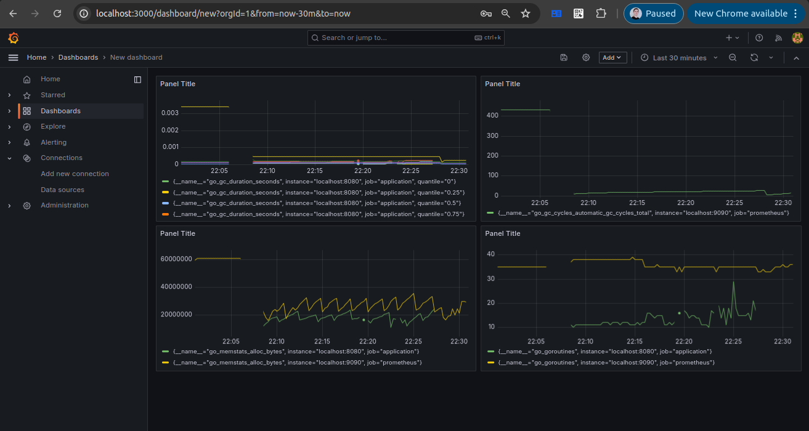
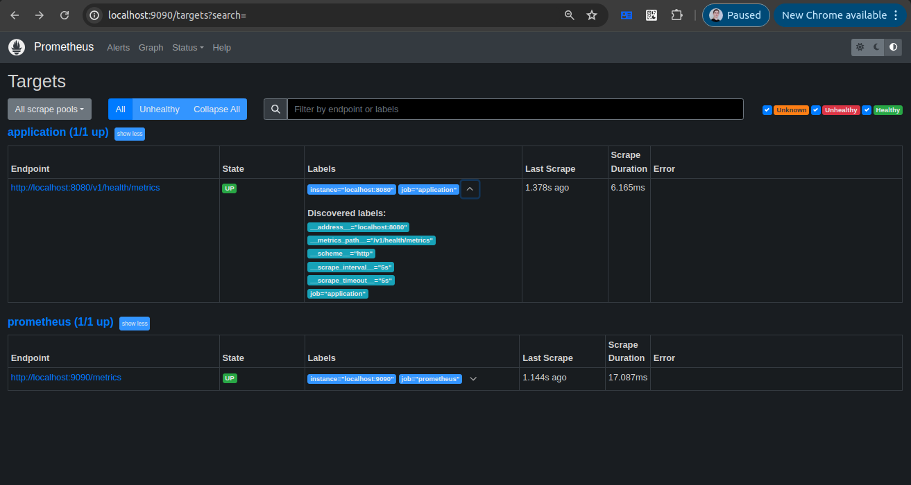
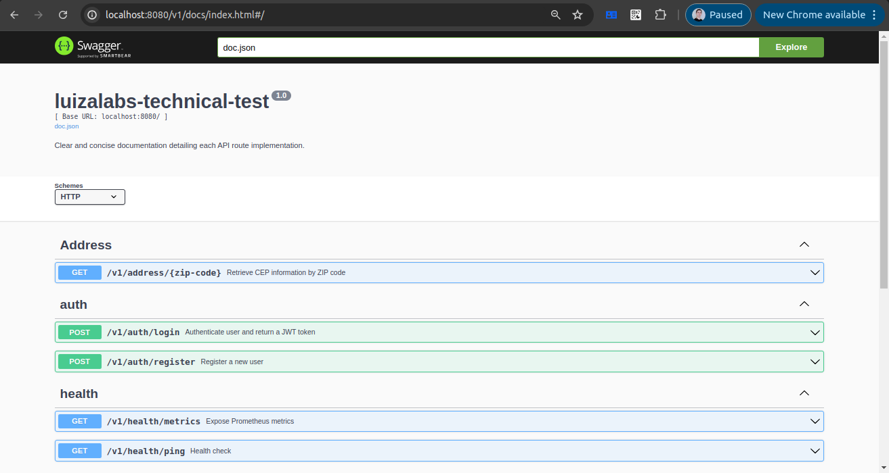

# luizalabs-technical-test

Olá, pessoal! Realizei este teste técnico com base em todo o meu conhecimento, com o objetivo de apresentar o meu melhor com o uso da liguagem GO. Espero que gostem!

Se houver alguma observação a ser feita, peço que me enviem para que eu possa realizar as correções necessárias. Agradeço desde já.

## 1 - Explicação técnica:

### Descrição

Este projeto tem como objetivo criar um serviço para a busca rápida de CEPs, utilizando as principais APIs de CEP disponíveis no Brasil.

A linguagem Go foi escolhida para realizar buscas concorrentes devido ao uso de goroutines e channels, além do seu escalonamento de tarefas de forma preemptiva. Sua agilidade, proporcionada por um runtime compacto e suas dependências reduzidas, juntamente com o uso de multi-stage builds no Docker, potencializa ainda mais a ferramenta. Fora isso, Go suporta HTTP/2, que torna a comunicação mais rápida, e, ao não delegar as threads do sistema operacional, gera lightweight threads, permitindo um processo de resposta ágil para esta aplicação.

Se um CEP válido não retornar um endereço, o sistema substituirá, um a um, os dígitos da direita para a esquerda por zero até encontrar um endereço correspondente, aumentando a ordem de grandeza. Por exemplo, ao fornecer o CEP 14570006 e não obter resultado, o sistema tentará variações como 14570000, 14500000 e assim por diante, até ter sucesso, retornando as informações da cidade de Buritizal neste caso.

### Arquitetura e documentação

Para a arquitetura do projeto, utilizei a convenção da comunidade proposta no repositório https://github.com/golang-standards/project-layout. Essa mesma abordagem é utilizada em grandes projetos (como Kubernetes) para manter um padrão, além de empregar técnicas já validadas por pesquisas de benchmark.

Além disso, implementei o design pattern `singleton` e a `clean-architecture` (pela questão dos `use-cases`, e um contexto global e único), idealizada por Uncle Bob. A pasta pkg foi utilizada para adicionar camadas de segurança entre os pacotes internos e o uso de bibliotecas, evitando que essas bibliotecas fiquem fortemente acopladas à linguagem. A camada de repository atuou como uma barreira anticorrupção, prevenindo complexidades futuras relacionadas a alterações de contratos ou interfaces públicas.

Adicionalmente, o nível de pasta "/feature" auxiliou na segregação de cada use-case, permitindo retornar mensagens de erro padronizadas (por meio do pacote de error handling) que facilitaram o rastreamento das ocorrências. Essa estrutura também possibilitou a separação das models e das estruturas utilizadas em cada camada da aplicação.

### Concorrência e Memory Management

Para garantir o padrão Singleton, especialmente nas conexões com o banco de dados, utilizei a função `once.Do`. Essa função assegura que, em funções que trabalham com _lazy loading_, não ocorram condições de corrida que poderiam resultar na reinicialização de múltiplas conexões com o mesmo banco de dados. Dessa forma, mesmo que o mesmo endereço de memória seja compartilhado, não há necessidade de usar _mutex_.

Para o acesso e a alteração de variáveis compartilhadas, como no caso do sistema de gerenciamento de cache local dentro do pacote `global`, utilizei um _mutex_. Isso evita que, em situações de conexões multiplexadas ou acesso simultâneo à mesma _hashtable_, ocorram leituras e gravações indesejadas.

Em casos como a busca de CEP e o escalonamento de várias _goroutines_, adicionei um _channel_ para garantir o padrão FIFO. Um _channel_ é uma forma de conectar múltiplas _goroutines_ e funciona como uma lista encadeada unidirecional com _mutual exclusion_ embutido. Assim, conseguimos garantir que a regra de negócio seja respeitada: o primeiro a retornar deve ser o valor enviado para o front. Além disso, implementei um _timeout_ de 5 segundos para evitar _deadlocks_ durante a execução do código.

### Testes e validações

Para garantir a eficácia dos testes, utilizei o `test-containers` para simular conexões reais com bancos de dados e validar operações, enquanto o `mockgen` foi empregado para testar a lógica das camadas de negócio. Já os testes unitários foram organizados em `test suites`, assegurando a manutenabilidade e organização do ambiente.

Nas pipelines de build, implementei a validação de linters, como `golint` e `staticcheck`, além do próprio build da imagem Docker, que funciona como um `teste de fumaça` e controle de qualidade interno. Para controle de manutenabilidade ao longo do tempo, também foram implementados jobs como o `dependecy-bot` para fazer a atualização periódia das dependencias do projeto assim que algum novo bump de versão (em qualquer pkg importado) é lançado.

### Como rodar o projeto

Para rodar o projeto, instale o pacote de comandos `make` e execute `make help` na raiz do projeto. Isso permitirá visualizar todos os comandos disponíveis que encapsulam as lógicas utilizadas na aplicação.

Em seguida, adicione um arquivo chamado `.env` na raiz do projeto, listando valores para cada uma das variáveis de ambiente disponíveis no arquivo `.env.example`. Execute a aplicação com os comandos `make dev-up` e `make run`, que, respectivamente, iniciarão os recursos auxiliares da aplicação por meio do Docker Compose e rodarão a aplicação (use a versão 1.23 do Go para isso).

\*\*Obs.: o fetch das dependencias já está embarcado no próprio comando `make`. Não sendo necessário executá-lo à parte.

Acessando o caminho `http://localhost:<SERVER_PORT>/v1/docs/index.html` conseguirá ver a documentação das rotas a serem usadas via swagger. Lá teram rotas que medem as métricas da aplicação por meio da integração com `grafana` e `prometheus` fora alguma rotas de health próprias da aplicação para verificação da sua saúde. Mais adiante, serão vistas ainda rotas para autenticação de usuário e verificação de cep.

| Command               | Description                               |
| --------------------- | ----------------------------------------- |
| **project**           |                                           |
| `all`                 | Install dependencies                      |
| `install`             | Install Go dependencies                   |
| `build`               | Build the application                     |
| `run`                 | Run the application                       |
| `test`                | Run tests with coverage                   |
| `clean`               | Clean up build files                      |
| `help`                | Show help message                         |
|                       |                                           |
| **Development**       |                                           |
| `dev-up`              | Start all resources used by the app       |
| `dev-stop`            | Stop all resources used by the app        |
| `dev-down`            | Delete all resources used by the app      |
|                       |                                           |
| **Swagger**           |                                           |
| `install-swagger-cli` | Install Swagger CLI globally              |
| `refresh-swagger`     | Refresh Swagger documentation             |
|                       |                                           |
| **Mocking**           |                                           |
| `install-mock-cli`    | Install mockgen CLI globally              |
| `run-mock`            | Generate/upgrade mock files automatically |
|                       |                                           |
| **Kubernetes**        |                                           |
| `run-kubernetes`      | Deploy Kubernetes infrastructure          |

## 2 - Como funcionam as requisições HTTP entre o Client e o Server:

(usei o exemplo do própio site da netshoes, conforme o enunciado)

- Digitar a URL: Você digita "http://www.netshoes.com.br" no navegador.
- Resolução de DNS: O navegador transforma "www.netshoes.com.br" em um endereço IP.
- Conexão: O navegador se conecta ao servidor da Netshoes.
- Envio da solicitação HTTP: O navegador manda uma solicitação HTTP para o servidor, pedindo a página inicial (ex.: GET).
- Processamento: O servidor da Netshoes recebe e processa a solicitação.
- Recebimento da resposta: O navegador recebe a resposta com a página da Netshoes.
- Renderização: O navegador exibe a página HTML recebida.
- Exibição: A página do site da Netshoes aparece para você.
